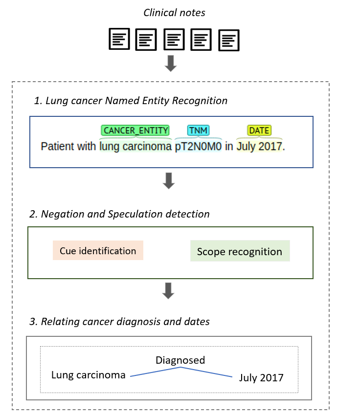

# Lung Cancer Diagnosis Extraction
This repository contains a hybrid approach to automatically extract lung cancer diagnosis from clinical notes written in Spanish.

The approach combines deep learning-based and rule-based methods to improve the lung cancer diagnosis extraction process. Figure 1  shows the proposed approach that integrates three steps: Lung cancer named entity recognition</a>, Negation and speculation detection, and Relating cancer diagnosis and dates. For each of these steps, a directory containing the source code has been created.

  

<h4> 1. Lung cancer named entity recognition (NER): </h4>
This step describes a deep learning model to extract lung cancer named entities from clinical notes written in Spanish. A BiLSTM-CRF  model is used to carry out named entity recognition. Before running this model, Tensorflow 2.3, Keras and Python 3.7 must be installed. The NER-BiLSTM directory contains three sub-directories:
<ul>
  <li><strong>libs:</strong> contains an implementation of the CRF layer, which is used to run the BiLSTM model. This layer is part of the keras_contrib/layers/crf installation.</li>
  <li><strong>Vectors:</strong> contains a vector representation of the lung cancer corpus, which was split into three sets (training, development, test). These sets are distributed in the next files: X_train, X_dev, X_test, y_train, y_dev, y_test. Additionally, the vectors directory contains the features subdirectory where vectors for lemmas and POS tag can be found.</li>
  <li><strong>Models:</strong> this directory contains the BiLSTM model implementation using different word embedding configurations.
  Medical embeddings for the Spanish language can be download from <a href= "https://zenodo.org/record/3626806#.X_w5mXUzY0Q"> Zenodo. </a> The Models directory contains the next  files: 
  <ul>
    <li><strong> 00-BiLSTM-CRF.ipynb:</strong> This file contains the BiLSTM-CRF base model proposed by \cite{Lample2016} is used</li>
    <li><strong> 01-BiLSTM-CRF + Medical_embeddings.ipynb:</strong> </li> 
    <li><strong> 02_BiLSTM-CRF_Medical+Char_Embeddings_.ipynb:</strong> </li> 
    <li><strong> 03-BiLSTM + Medical Embeddings + Lemma + Postag:</strong>  </li>
    <li><strong> 04_BiLSTM + Medical_Embeddings + Char + Lemma + PosTag.</strong>  </li>
         
  </ul>
   To open and run any of these files, the <a href= "https://jupyter.org/"> Juypiter tool </a>  must be installed. In our experiments, the model that obtained best results for the NER task  was  executing the file 04_BiLSTM + Medical_Embeddings + Char + Lemma + PosTag  
</li>
</ul>

<h4> 2. Negation and speculation detection: </h4>
Detecting speculation and negation is a crucial step to extract the cancer diagnosis correctly. This section shows a rule-based approach to detect negation and speculation in clinical texts written in Spanish. The rule-based approach was developed using Java and Eclipse. The UDPipe external jar is required to run the application. This jar file can be found in the <a href= "https://github.com/solarte7/lung_cancer_diagnosis/tree/main/negation_speculation/lib"> lib </a> directory.  

To test this tool make sure you have previously installed <a href = "https://www.java.com/es/Java"> Java </a> 1.8 or higher and <a href ="https://www.eclipse.org/downloads/"> Eclipse IDE </a>. 

To execute the Negation and speculation detection step,  you must use the <strong>Main.java </strong> file. This file receives a sentence text written in Spanish and returns the detected <strong>cues </strong> and the <strong>scope</strong> for each cue. The Negation and speculation detection contains three main files:
 <ul>
  <li><strong>DictionaryLoader.java</strong>: this file loads the Cues lexicon previously created. This lexicon contains a set of specialized cues to detect negation and speculation in clinical texts written in Spanish.</li>
  <li><strong>CuesDetector.java</strong>: this file implements rules required to recognize negation and speculation cues in a sentence text.</li>
  <li><strong>ScopeResolution.java</strong>: this file implements rules required to extract the scope for each detected cue. 
    
 </ul>

<h4> 3. Relating cancer diagnosis and dates: </h4>
Once lung cancer named entities have been extracted, and negation and speculation detection has been solved; the only task that is needed is to extract the cancer diagnosis is relating cancer entities to dates. In this step, the cancer diagnosis is linked to the proper diagnosis date. For developing this step was used Java and Eclipse. The UDPipe external jar is also required to run the application. Since we are working with real data from cancer patients in this project, we cannot share the test database, we only share the source code.

<strong>References:</strong> 
Lample, G.; Ballesteros, M.; Subramanian, S.; Kawakami, K.; Dyer, C.  Neural architectures for named entity  recognition.2016  Conference  of  the  North  American  Chapter  of  the  Association  for  Computational Linguistics: Human Language Technologies, NAACL HLT 2016 

